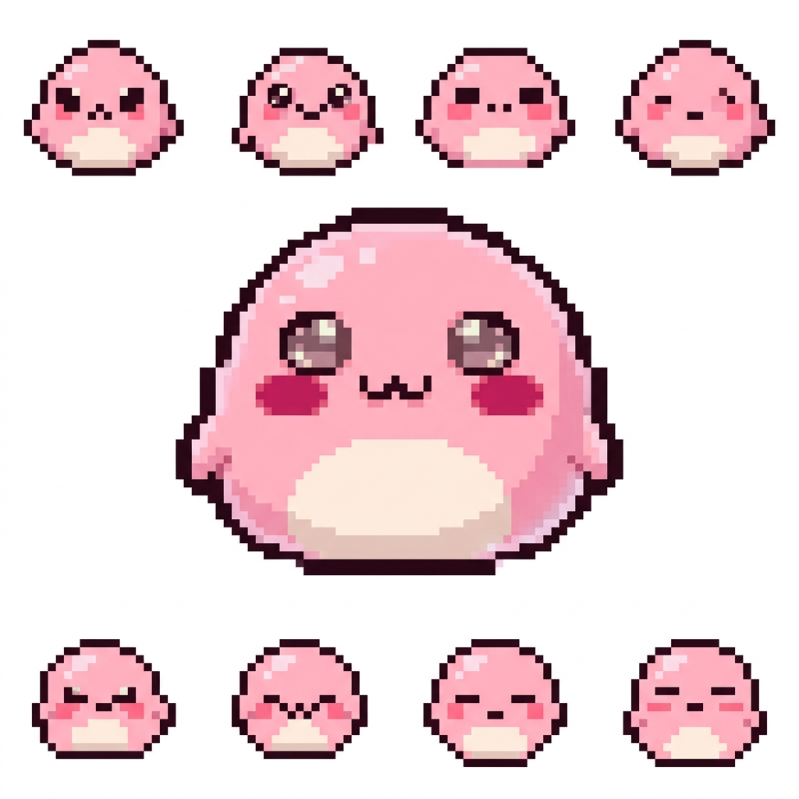

<div align="center">

# 🍡 Mochi Terminal Pets

**Your terminal sessions, alive.**

[](https://github.com/Yesol-Pilot/mochi-terminal-pets/releases)
[](LICENSE)
[](https://neo-genesis.itch.io/mochi-terminal-pets)
[](https://github.com/sponsors/Yesol-Pilot)



*A lightweight desktop overlay that turns your terminal sessions into cute animated pixel pets.*

[**📥 Download**](https://github.com/Yesol-Pilot/mochi-terminal-pets/releases/latest) · [**🌐 Website**](https://yesol-pilot.github.io/mochi-terminal-pets/) · [**🎮 itch.io**](https://neo-genesis.itch.io/mochi-terminal-pets) · [**☕ Support**](https://ko-fi.com/neogenesis)

</div>

---

## ✨ Features

| Feature | Description |
|:---|:---|
| **Ambient CPU Awareness** | Pets walk when terminals work, sleep when idle |
| **AI Token Tracking** | Real-time context window usage for Codex, Claude, and other agents |
| **Click-to-Focus** | Click a pet's nameplate to jump to that terminal tab |
| **Drag & Pin** | Manually position pets anywhere on the bottom band |
| **Completion Alerts** | Audio + visual bubble when background tasks finish |
| **Custom Skins** | Bring your own pixel art sprites and sounds |
| **Zero Config** | Auto-detects terminal sessions via cmux or local process scan |

## 🚀 Quick Start

### macOS
```sh
# Build
scripts/build.sh

# Run
scripts/run.sh

# Background (LaunchAgent)
scripts/start-background.sh
```

### Windows
```sh
pip install PySide6
pythonw src/overlay.py
```

## 🎨 Custom Skins

Drop your own sprite into the `assets/` folder and update `config.json`:

```json
{
  "skinFolder": "assets/my-custom-skin"
}
```

Your skin folder should contain:
- `mochi-front.png` — static front-facing sprite (28–36px recommended)
- `mochi-front-animated.gif` — optional animated GIF with multiple frames

## ⚙️ Configuration

Edit `config.json` to tune behavior without touching source code:

- `workingCpuThreshold` / `workingCpuExitThreshold` — CPU hysteresis thresholds
- `fpsActive` / `fpsIdle` / `fpsQuiet` — animation frame rates by state
- `pollIntervalSeconds` — how often to read terminal state
- `showShellTabs` — include plain shell tabs (default: agent tabs only)
- `soundEffectsEnabled` — toggle interaction sounds
- `petDraggingEnabled` — allow manual pet repositioning

## 📡 Monitor Mode

Mochi supports two monitoring backends:

- **cmux** (default if installed) — reads `cmux top` for terminal session data
- **local** — falls back to `ps` process scanning when cmux is not available

## 📋 Requirements

- **macOS**: Xcode Command Line Tools (for `clang`)
- **Windows**: Python 3.8+ with PySide6 or PyQt5
- **Optional**: [cmux](https://github.com/manaflow-ai/cmux) for enhanced terminal session tracking

## 💖 Support This Project

If Mochi makes your terminal sessions happier, consider supporting development:

- ⭐ **Star this repo** — it helps others discover Mochi
- 💝 [**GitHub Sponsors**](https://github.com/sponsors/Yesol-Pilot) — monthly support
- ☕ [**Ko-fi**](https://ko-fi.com/neogenesis) — one-time tip
- 🎮 [**itch.io**](https://neo-genesis.itch.io/mochi-terminal-pets) — pay what you want

## 📄 License

MIT License — see [LICENSE](LICENSE) file.

---

<div align="center">

Made with 🍡 by [Neo Genesis](https://neogenesis.app)

</div>
